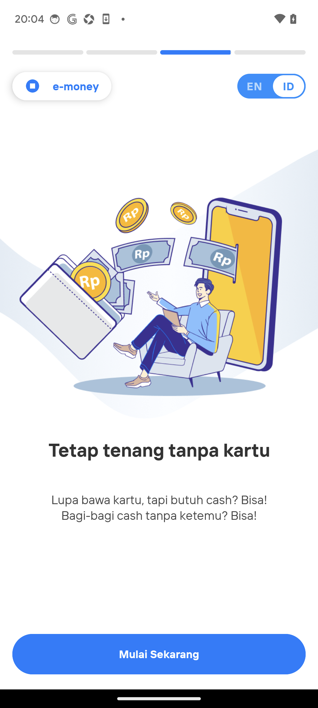

# Java + Native 组合 Hook 实测

本文只记录 `scripts/java-native-hook.js` 的实测方法和证据。环境准备、激活、启停、
独立 Java/Native 示例及故障处理统一见 [README](README.md)；脚本的当前行为以
[`scripts/java-native-hook.js`](scripts/java-native-hook.js) 为准。

## 测试方法

测试时间为 2026-09-09，环境如下：

| 项目 | 值 |
| --- | --- |
| 设备 | Pixel 6 |
| 系统 | Android 14 / arm64 |
| 权限 | 已 root，配套内核模块已启用 |
| Frida | `17.9.1` |
| Java bridge | 仓库内置 `_agent.js` |
| 单轮观察窗口 | 60 秒 |

脚本在同一 Frida 会话中安装三个定点 Hook：

| 钩子 | 层 | 形式 | 观测内容 |
| --- | --- | --- | --- |
| `libc.so!open` | Native | `Interceptor.attach` + `textShadow` | 文件打开；只打印前 8 条 |
| `android.app.Activity.onResume()` | Java | `.implementation` | resumed Activity 类名 |
| `android.util.Log.i(String, String)` | Java | 静态方法 `.implementation` | tag 与 message；只打印前 8 条 |

回调均为 JavaScript，不使用 CModule。脚本每 10 秒输出三类 Hook 的累计命中数和当前
PID，用于确认会话仍存活且两条 Hook 链路持续工作。

执行命令：

```bash
PACKAGE="<TARGET_PACKAGE>"
uv run frida -H 127.0.0.1:27042 \
  -f "$PACKAGE" \
  -l frida-java-bridge/_agent.js \
  -l scripts/java-native-hook.js
```

存活判定同时参考脚本心跳和设备端进程状态。目标若修改进程名，以心跳中的 PID 反查
`/proc/<pid>/comm`，不只依赖 `pidof "$PACKAGE"`。

## 结果总览

下表命中数统一取日志中的 60 秒心跳，避免混用会话结束时的最终计数。

| App | 包名 | 已知保护 | `open` | `onResume` / `Log.i` | 60 秒内存活 | detach 后存活 |
| --- | --- | --- | ---: | ---: | --- | --- |
| Hay Day | `com.supercell.hayday` | Promon SHIELD | 1194 | 2 / 26 | 是 | 是 |
| Paytm | `net.one97.paytm` | 自研 cachehandler | 4311 | 3 / 12 | 是 | 否，进程自行退出 |
| Livin' by Mandiri | `id.bmri.livin` | DexGuard + 自研 | 384 | 1 / 6 | 是 | 是 |
| K PLUS | `com.kasikorn.retail.mbanking.wap` | DexProtector + VOS | 435 | 4 / 1 | 是，三进程 | 是，三进程 |

四个目标在本次 60 秒窗口内均完成 Java 与 Native Hook 安装和触发，未观察到崩溃或
被杀。

## 日志与截图

日志均为终端输出删节，省略 REPL 横幅，只保留安装、命中和心跳行。

### Hay Day

```text
Spawning `com.supercell.hayday`...
[native] libc.so!open hook installed @ 0x7c15ed2a70
Spawned `com.supercell.hayday`. Resuming main thread!
[native] open("/proc/self/cmdline") = 72
[native] open(".../com.supercell.hayday-.../base.apk") = 72
[java] android.app.Activity.onResume() hook installed
[java] android.util.Log.i(String, String) hook installed
[java] Activity.onResume <- com.supercell.hayday.GameApp
[java] Log.i Choreographer: Skipped 38 frames!  ...
[alive] 10s pid=4538 native_open=1045 onResume=2 Log_i=23
[alive] 30s pid=4538 native_open=1146 onResume=2 Log_i=26
[alive] 60s pid=4538 native_open=1194 onResume=2 Log_i=26
```

进程在注入期间和会话结束后均存活。截图采集于约 22 秒：


### Paytm

```text
Spawning `net.one97.paytm`...
[native] libc.so!open hook installed @ 0x7c15ed2a70
[java] android.app.Activity.onResume() hook installed
[java] android.util.Log.i(String, String) hook installed
[java] Log.i PlayCore: UID: [10291]  PID: [8953] StandardIntegrity : warmUpIntegrityToken(...)
[java] Activity.onResume <- net.one97.paytm.landingpage.activity.AJRMainActivity
[java] Activity.onResume <- net.one97.paytm.auth.activity.AJRAuthActivity
[alive] 10s pid=8953 native_open=1491 onResume=3 Log_i=10
[alive] 60s pid=8953 native_open=4311 onResume=3 Log_i=12
```

该目标的 `cmdline` 在测试中显示为 Chrome 沙箱进程名，但 `/proc/<pid>/comm` 仍为
`net.one97.paytm`，因此存活状态以脚本心跳 PID 和 `comm` 交叉确认。三轮结果一致；
会话结束后目标进程自行退出。


### Livin' by Mandiri

```text
Spawning `id.bmri.livin`...
[native] libc.so!open hook installed @ 0x7c15ed2a70
[java] android.app.Activity.onResume() hook installed
[java] android.util.Log.i(String, String) hook installed
[java] Log.i GoogleTagManager: Loading container GTM-M4QZ783
[java] Activity.onResume <- com.bankmandiri.md.presentation.ui.MainActivity
[java] Log.i Choreographer: Skipped 65 frames!  ...
[alive] 10s pid=29784 native_open=373 onResume=1 Log_i=6
[alive] 60s pid=29784 native_open=384 onResume=1 Log_i=6
```

进程在注入期间和会话结束后均存活。



### K PLUS

```text
Spawning `com.kasikorn.retail.mbanking.wap`...
[native] libc.so!open hook installed @ 0x7c15ed2a70
[java] android.app.Activity.onResume() hook installed
[java] android.util.Log.i(String, String) hook installed
[java] Activity.onResume <- com.kasikorn.retail.mbanking.kplus.home.activity.SplashScreenActivity
[java] Activity.onResume <- com.karumi.dexter.DexterActivity
[java] Activity.onResume <- com.kasikorn.kcore.presentation.mobileno.VerifyMobileNoActivity
[alive] 10s pid=4239 native_open=363 onResume=4 Log_i=1
[alive] 60s pid=4239 native_open=435 onResume=4 Log_i=1
```

该目标在测试中包含三个进程，注入期间和会话结束后均保持存活。验证页设置了
`FLAG_SECURE`，下图由 root `screencap` 采集：


> 该截图包含手机号输入页，公开引用前应再次检查画面内容。

## 结论边界

- 结果只覆盖表中环境、目标版本和 60 秒观察窗口，属于点查，不代表长期兼容性。
- 命中数只描述当前进程、当前地址和当前观测窗口，不能证明未 Hook 路径没有执行。
- 更换设备、系统、App 版本、启动方式或 Hook 组合后，应按 README 重新建立四组基线。
- `_agent.js` 初始化时可能输出 `[object Object]`，本次测试中该行不影响 Hook 安装。
